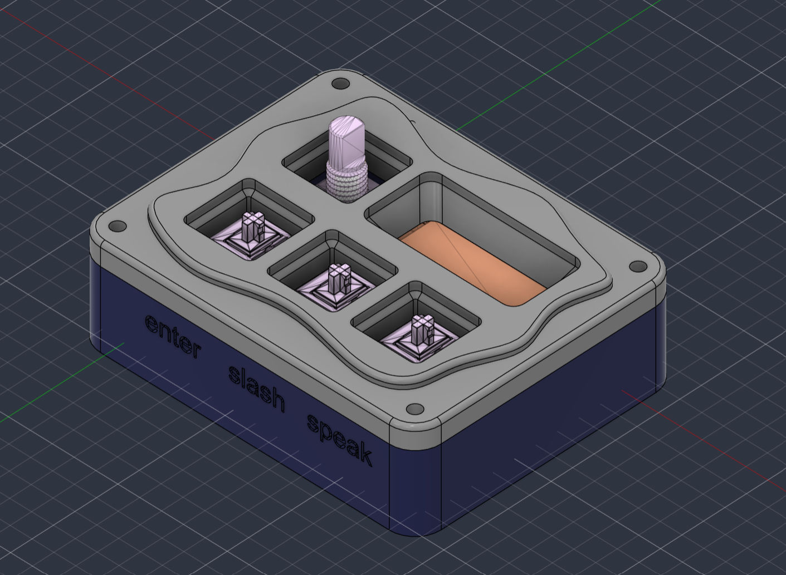
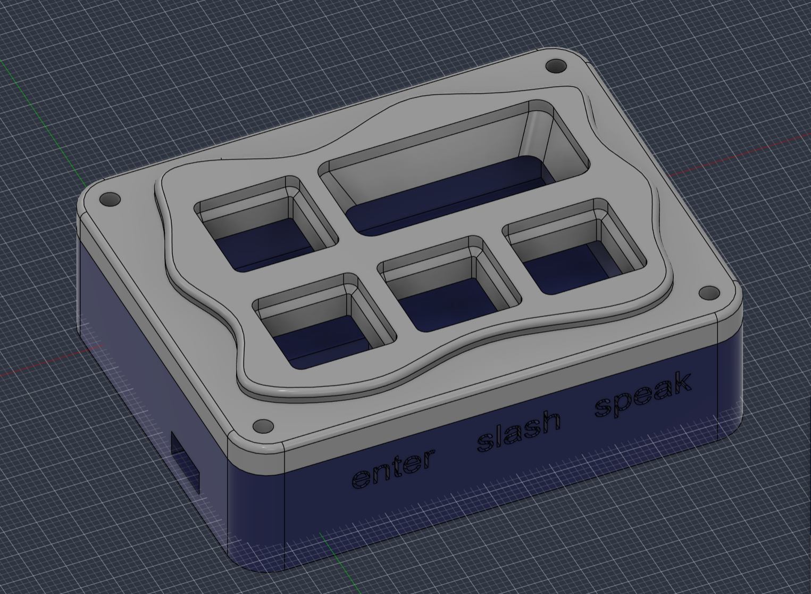
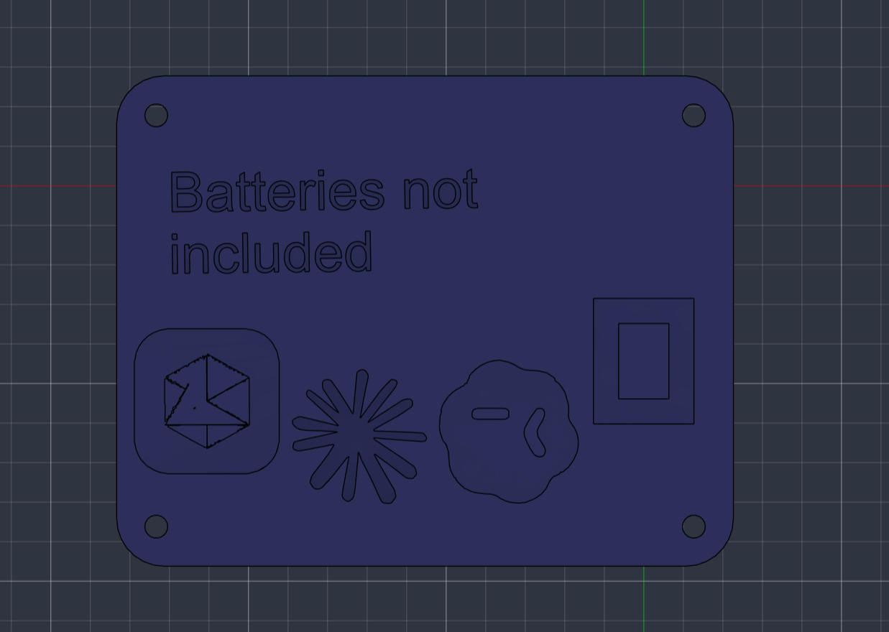

# AgentBoard

A macropad for controlling Claude Code and Codex sessions. The hardware design is currently complete; the build is a work in progress.

| Top | Bottom |
| --- | --- |
|  |  |

## Features
- 3 Keys: forward slash for commands, enter (obvisouly), push-to-talk
- Encoder to shuffle between answer choices
- Encoder switch to shuffle between permission modes

## Technical Details

The board is built around the XIAO RP2040, three push buttons, an Alps EC11 rotary encoder with switch, and a 128x32 SSD1306 OLED connected over I2C.

## Bill of Materials

Full machine-readable list: [`BOM.csv`](BOM.csv)

| Item | Reference | Qty | Part | Notes |
| --- | --- | --- | --- | --- |
| 1 | U1 | 1 | Seeed Studio XIAO RP2040 | RP2040-based USB microcontroller module |
| 2 | SW1-SW3 | 3 | MX-style mechanical switch | Any Cherry MX compatible switch |
| 3 | SW4 | 1 | Alps EC11E rotary encoder | With integrated push switch, vertical, 20mm shaft |
| 4 | J1 | 1 | 0.91" SSD1306 OLED | 128x32, I2C, 4-pin header |
| 5 | PCB1 | 1 | AgentBoard PCB | 2-layer, order from JLCPCB/PCBWay |
| 6 | KN1 | 1 | Rotary encoder knob | 6mm D-shaft, optional |
| 7 | KC1-KC3 | 3 | 1u keycaps | Cherry MX profile |

## Motivation

I always wanted an easy way to control my sessions and having a small macropad definitely doesn't make a substantial decrease in ease of use however it tricks my mind into making it seem very effortless, compared to using an entire keyboard. Just 3-4 keys!

## Future

I really wish to add bluetooth support and maybe even wifi. Possibly turning this into a pocket agent that you can take with you and allows you to control your sessions remotely. However this isn't much different from the Claude/GPT app so I need to narrow the scope down a little more. Another direction I was looking into was a desktop buddy. Need to explore more. 

## Repo Index

### Start Here

| Path | Purpose |
| --- | --- |
| [`README.md`](README.md) | Project overview, features, motivation, and this repository map |
| [`BOM.csv`](BOM.csv) | Bill of materials |
| [`firmware/readme.md`](firmware/readme.md) | QMK build and flashing notes |

### Hardware: KiCad

| Path | Purpose |
| --- | --- |
| [`agentboard_pcb/AgentBoard.kicad_pro`](agentboard_pcb/AgentBoard.kicad_pro) | KiCad project settings |
| [`agentboard_pcb/AgentBoard.kicad_sch`](agentboard_pcb/AgentBoard.kicad_sch) | Source schematic |
| [`agentboard_pcb/AgentBoard.kicad_pcb`](agentboard_pcb/AgentBoard.kicad_pcb) | Source PCB layout |

### Hardware: CAD Files

| Path | Purpose |
| --- | --- |
| [`PCB/AgentBoard.step`](PCB/AgentBoard.step) | 3D CAD model in STEP format |
| [`PCB/AgentBoard.stl`](PCB/AgentBoard.stl) | 3D CAD model in STL format |

### Hardware: Visual References

| Path | Purpose |
| --- | --- |
| [`assets/schematic.png`](assets/schematic.png) | Schematic preview |
| [`assets/pcb.png`](assets/pcb.png) | PCB layout preview |
| [`assets/cad-top.png`](assets/cad-top.png) | Top-side CAD preview |
| [`assets/cad-bottom.png`](assets/cad-bottom.png) | Bottom-side CAD preview |
| [`assets/cad-w-components.png`](assets/cad-w-components.png) | CAD preview with components |

### Firmware: QMK

| Path | Purpose |
| --- | --- |
| [`firmware/keyboard.json`](firmware/keyboard.json) | Keyboard identity, RP2040 target, pins, layout, and enabled features |
| [`firmware/rules.mk`](firmware/rules.mk) | QMK board, OLED, I2C, and encoder build settings |
| [`firmware/config.h`](firmware/config.h) | I2C pins, OLED address/size, encoder resolution, and timeouts |
| [`firmware/agentboard.h`](firmware/agentboard.h) | Keyboard header included by QMK |
| [`firmware/keymaps/default/keymap.c`](firmware/keymaps/default/keymap.c) | Default keymap, custom keycodes, encoder actions, and OLED status screen |